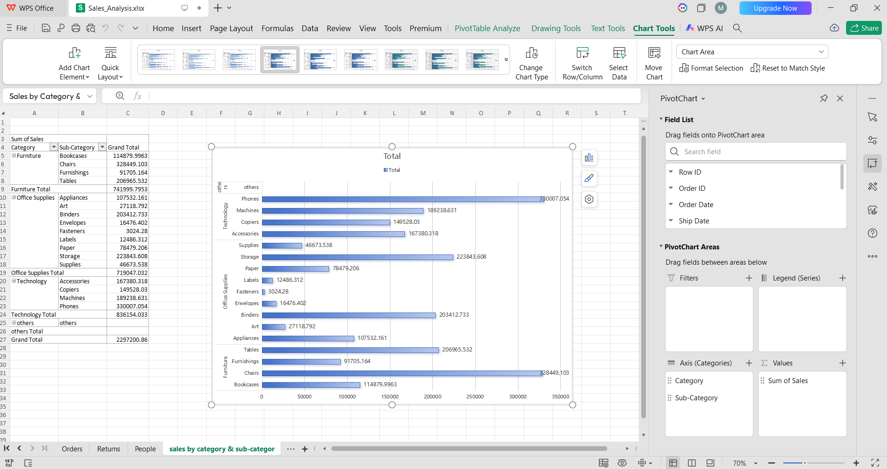
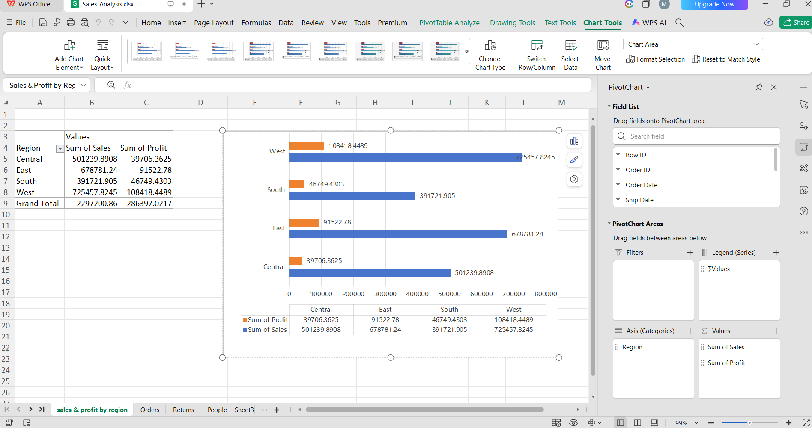

# 📊 Task 1: Sales Analysis
## 🎯 Objective
Analyze sales performance using Excel and identify trends across categories, sub-categories, and regions.
## 🛠 Tools Used
- Excel
- Pivot Tables
- Pivot Charts
## 📂 Files Included
- Sales_Analysis.xlsx
- category_subcategory_sales_chart.png
- region_sales&profit_chart.png
## 📈 Analysis Performed
- Category & Sub-Category Sales Analysis
- Regional Sales & Profit Analysis
## 📊 Charts
### 1️⃣ Category & Sub-Category Sales

### 2️⃣ Regional Sales & Profit Analysis

## 💡 Key Insights
- Technology category generated higher sales.
- Some sub-categories contributed more profit.
- Regional sales performance differed significantly.
## 📌 Conclusion
This analysis helped identify important business trends and sales performance patterns using Excel dashboards and charts.
