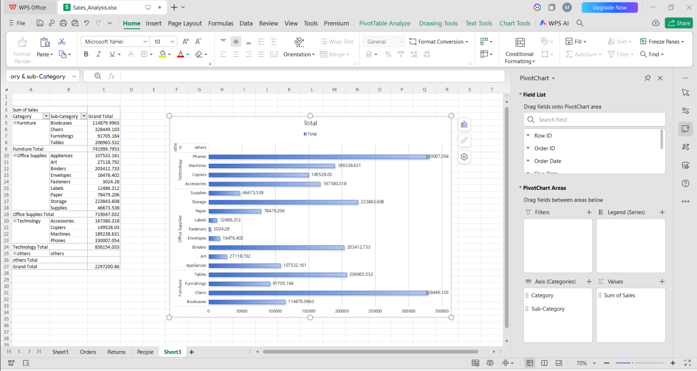
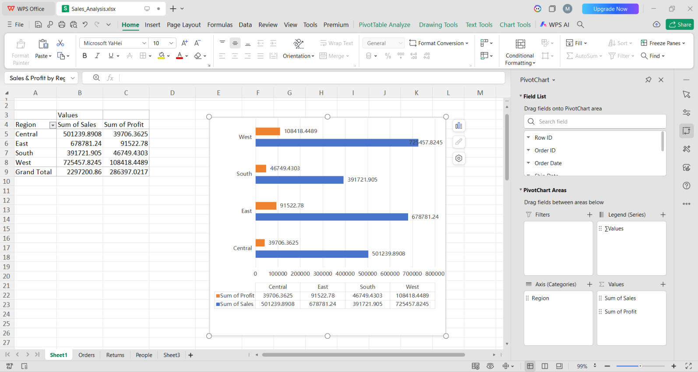

# 📊 Task 1: Sales Analysis
## 🎯 Objective
Analyze sales data to identify trends, top-performing categories, and regional performance.
## 🛠 Tools Used
- Excel (Pivot Tables, Charts)
## 📂 Dataset
Superstore Sales Dataset
## 📈 Analysis Performed
- Sales by Category
- Sales by Sub-Category
- Sales by Region
## 📊 Charts
### 1️⃣ Category & Sub-Category Sales

### 2️⃣ Region Sales vs Profit

## 💡 Key Insights
- West region has highest sales
- Technology category performs best
- Some sub-categories contribute major revenue
## 📌 Conclusion
This analysis helps understand business performance and identify key areas for growth.
