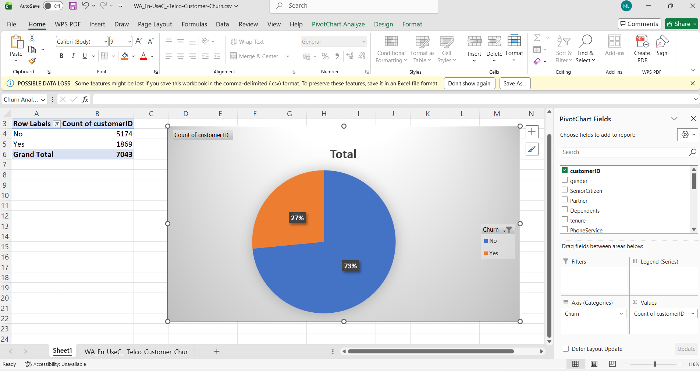
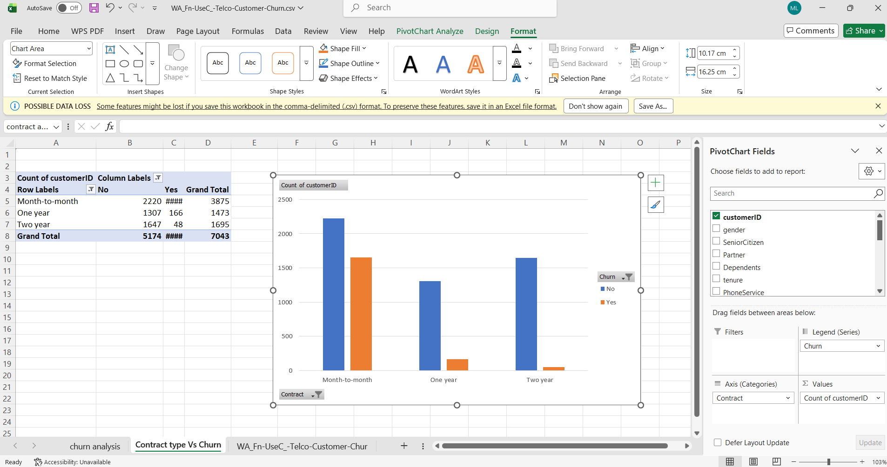
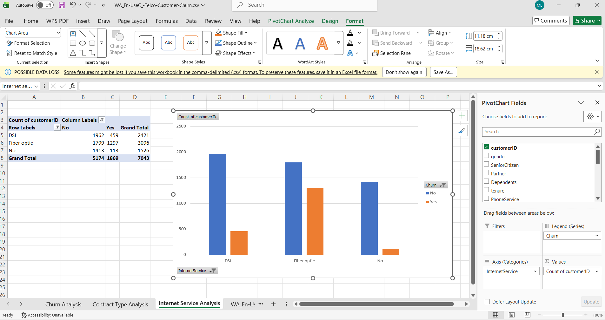
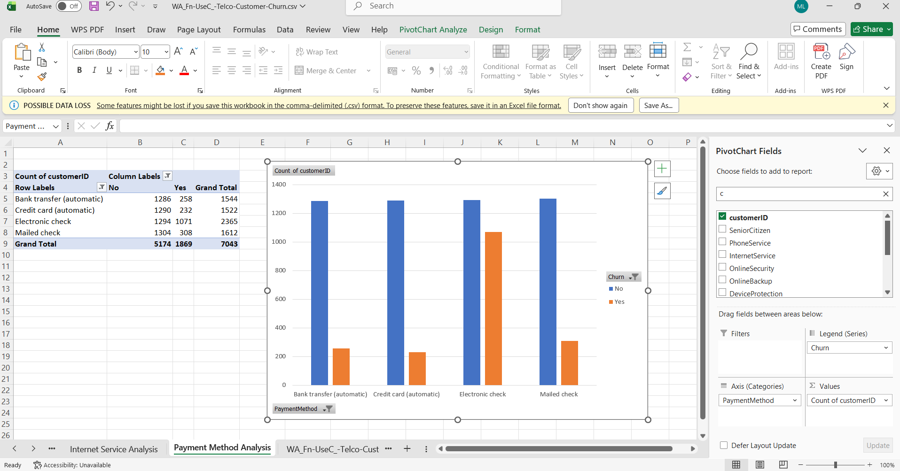
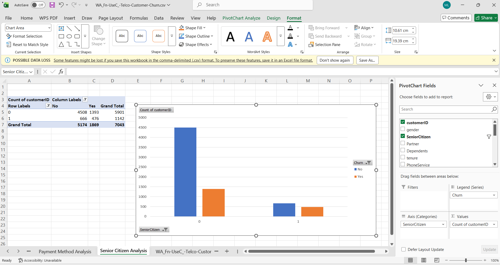
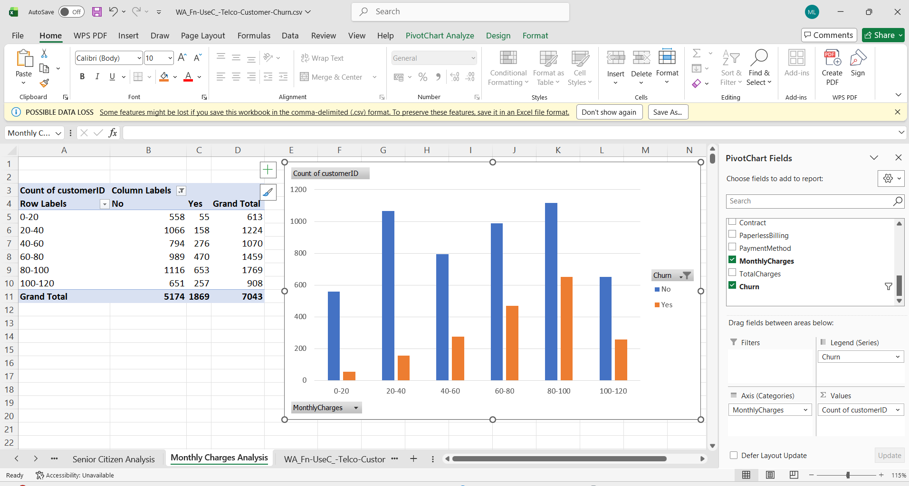

# 📊 Task 2: Customer Retention & Churn Analysis
## 🎯 Objective
Analyze customer churn patterns and identify factors affecting customer retention.
## 🛠 Tools Used
- Excel (Pivot Tables & Charts)
## 📂 Dataset
Telco Customer Churn Dataset
## 📈 Analysis Performed
- Customer Churn Overview
- Contract Type vs Churn
- Internet Service vs Churn
- Payment Method vs Churn
- Senior Citizen vs Churn
- Monthly Charges vs Churn
## 📊 Charts
### 1️⃣ Customer Churn Overview

### 2️⃣ Contract Type vs Churn

### 3️⃣ Internet Service vs Churn

### 4️⃣ Payment Method vs Churn

### 5️⃣ Senior Citizen vs Churn

### 6️⃣ Monthly Charges vs Churn

## 💡 Key Insights
- Month-to-month customers show highest churn.
- Fiber optic users have higher churn rates.
- Electronic check users churn more frequently.
- Higher monthly charges increase churn probability.
- Long-term contracts improve retention.
## 📌 Conclusion
This analysis helps identify customer behavior patterns and factors influencing churn, enabling businesses to improve customer retention strategies.
