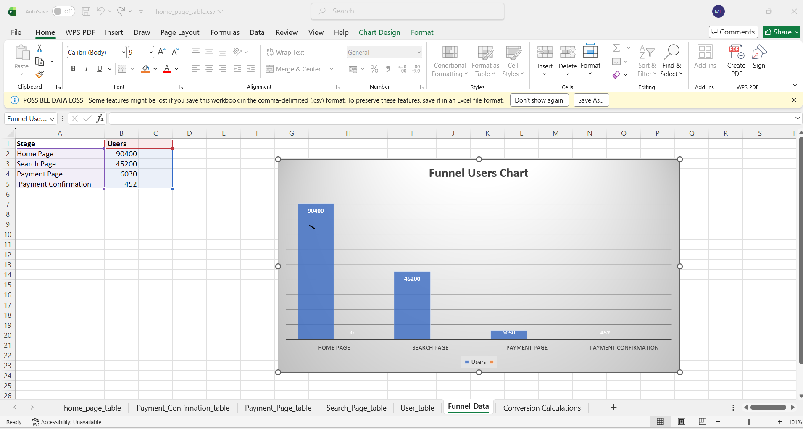
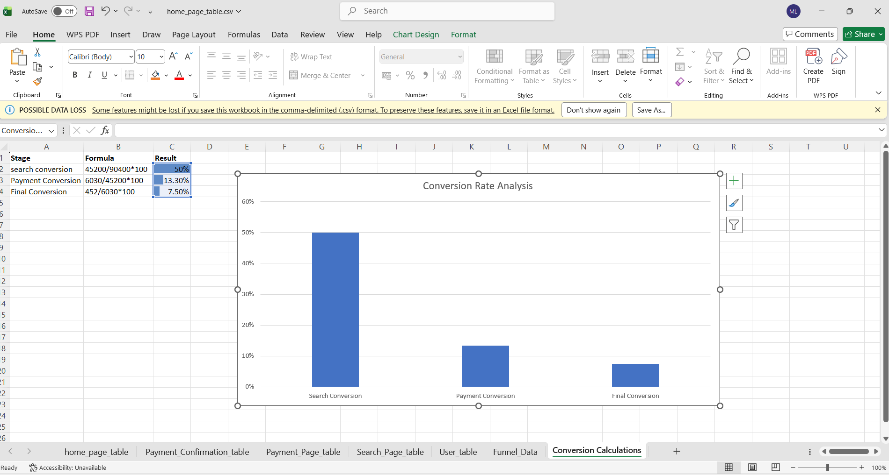

# Funnel Analysis Excel Project
## Project Overview
This project analyzes user behavior through a marketing funnel using Excel.  
The analysis tracks users from the Home Page to Payment Confirmation stage and calculates conversion rates at each step.
---
## Tools Used
- Microsoft Excel / WPS Office
- Pivot Charts
- Data Visualization
- Conversion Rate Analysis
---
## Funnel Stages
- Home Page
- Search Page
- Payment Page
- Payment Confirmation
---
## User Analysis
| Stage | Users |
|-------|-------|
| Home Page | 90400 |
| Search Page | 45200 |
| Payment Page | 6030 |
| Payment Confirmation | 452 |
---
## Conversion Rates
| Stage | Conversion Rate |
|-------|----------------|
| Search Conversion | 50% |
| Payment Conversion | 13.30% |
| Final Conversion | 7.50% |
---
## Visualizations
- Funnel Users Chart
- Conversion Rate Analysis Chart
---
## Files Included
- Funnel_Analysis.xlsx
- Funnel_User_chart.png
- Conversion-Rate_Analysis.png
---
## Learning Outcome
Learned:
- Funnel Analysis
- Conversion Tracking
- Excel Charts
- Data Visualization
- User Behavior Analysis
---
## Project Screenshots
### Funnel Users Chart

### Conversion Rate Analysis

